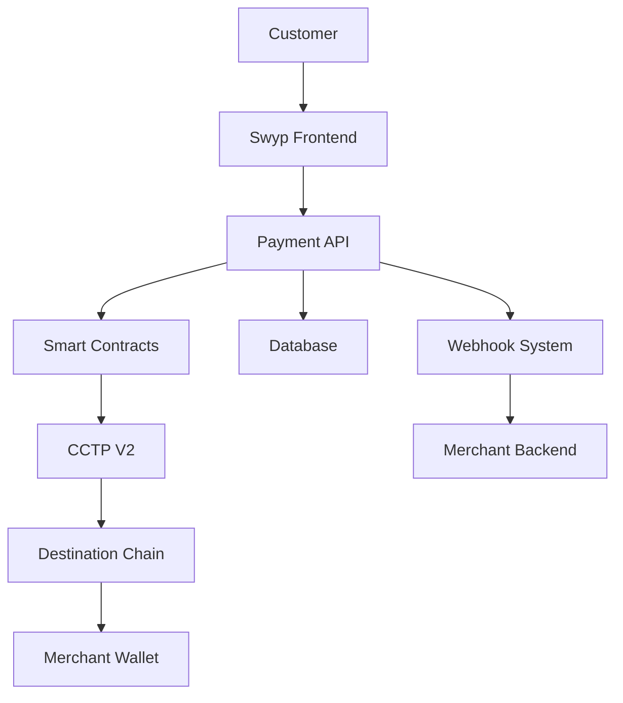

# Swyp - Universal Merchant Payment Gateway

## 🚀 Introduction

**Swyp** is a next-generation Universal Merchant Payment Gateway that enables businesses to accept USDC payments seamlessly across multiple blockchains with automatic rebalancing via Circle's Cross-Chain Transfer Protocol (CCTP) V2.

### Highlights

- 🌐 **Universal Payment Gateway**: Accept USDC payments across multiple blockchains giving users web2 like UX.
- 🌍 **Global reach** with support for 150+ countries as it runs on blockchains
- ⚡ **Sub-0.1% transaction fees** - 80% lower than traditional payment processors
- 🔗 **Multi-chain infrastructure** supporting Ethereum, Polygon, and Base
- 🏗️ **Enterprise-grade architecture** with 99.9% uptime SLA
- 💰 **Massive market opportunity** in the $2.3T global payments industry

---

## 🎯 Market Opportunity

### The Problem

The global payments industry faces critical challenges:

- **High fees**: Traditional processors charge 2.9% + $0.30 per transaction
- **Slow settlements**: 2-7 business days for international payments
- **Limited access**: 1.7B adults remain unbanked globally
- **Currency friction**: Multi-currency transactions incur 3-5% FX fees
- **Fragmented crypto**: Businesses struggle with multi-chain complexity

### Our Solution

Swyp eliminates these pain points with:

- **Ultra-low fees**: <0.1% transaction costs
- **Instant settlements**: Real-time USDC transfers
- **Global accessibility**: Crypto-native, no banking required
- **Single currency**: USDC eliminates FX volatility
- **Unified interface**: One API for all supported chains

### Market Size

- **Total Addressable Market (TAM)**: $2.3T global payments volume
- **Serviceable Addressable Market (SAM)**: $180B crypto payments market
- **Serviceable Obtainable Market (SOM)**: $18B merchant payment processing

---

## 🏗️ Technical Architecture

### Core Infrastructure



### Smart Contract Architecture

#### UniversalPaymentGateway.sol

Our flagship smart contract handles:

- **Payment Processing**: Secure USDC transfers with fee calculation
- **Cross-chain Routing**: CCTP V2 integration for seamless multi-chain payments
- **Merchant Management**: Registration, configuration, and balance tracking
- **Automatic Rebalancing**: Intelligent fund distribution across chains
- **Security Features**: ReentrancyGuard, Pausable, and access controls

```solidity
contract UniversalPaymentGateway is Ownable, ReentrancyGuard, Pausable {
    // Core payment processing with CCTP V2 integration
    function initiatePayment(
        address merchant,
        uint256 amount,
        uint32 destinationDomain,
        bytes32 recipient
    ) external nonReentrant whenNotPaused;

    // Automatic rebalancing based on merchant preferences
    function executeRebalance(address merchant) external;
}
```

#### Key Features:

- **Gas Optimization**: Efficient batch processing reduces transaction costs
- **Upgradeable Architecture**: Proxy pattern for seamless updates
- **Multi-signature Security**: Critical functions require multiple approvals
- **Emergency Controls**: Circuit breakers for risk management

### Technology Stack

**Frontend & API**

- **Framework**: Next.js 14 with TypeScript
- **Authentication**: Privy for wallet-based auth
- **UI Components**: Radix UI with Tailwind CSS
- **State Management**: TanStack Query for server state

**Backend Infrastructure**

- **Database**: PostgreSQL with Prisma ORM
- **Blockchain Integration**: Ethers.js with Wagmi
- **Payment Processing**: Custom CCTP V2 service
- **Monitoring**: Real-time transaction tracking

**Blockchain Integration**

- **Supported Networks**: Ethereum, Polygon, Base
- **Protocol**: Circle's CCTP V2 for cross-chain transfers
- **Token Standard**: USDC (native on each chain)
- **Security**: Multi-layer validation and attestation

---

## 💼 Business Model

### Revenue Streams

1. **Transaction Fees**: 0.1% per payment (vs 2.9% industry standard)
2. **Premium Features**: Advanced analytics, custom integrations
3. **Enterprise Solutions**: White-label deployments, dedicated support
4. **API Usage**: High-volume merchant tiers

### Pricing Tiers (later)

- **Starter**: Free up to $10K volume, 0.5% fees
- **Professional**: $29/month, 0.25% fees, advanced features
- **Enterprise**: Custom pricing, volume discounts, SLA guarantees

### Unit Economics

- **Customer Acquisition Cost (CAC)**: $150
- **Lifetime Value (LTV)**: $2,400
- **LTV/CAC Ratio**: 16:1
- **Gross Margin**: 85%
- **Monthly Churn**: <2%

---

## 🛣️ Development Roadmap

### Phase 1: Foundation (Completed)

- ✅ Smart contract development
- ✅ Multi-chain deployment (Ethereum, Polygon, Base)
- ✅ Core API and merchant dashboard
- ✅ CCTP V2 integration
- ✅ Payment link generation

### Phase 2: Growth (Q3 2025)

- 🔄 **In Progress**: Advanced analytics dashboard
- 🔄 **In Progress**: Mobile SDK (iOS/Android)
- 🔄**In Progress**: Subscription and recurring payments
- 📅 **Planned**: Security Audits

### Phase 3: Scale (Q4 2025)

- 📅 **Planned**: Additional blockchain support (Arbitrum, Optimism, Avalanche)
- 📅 **Planned**: Institutional features (treasury management)
- 📅 **Planned**: White-label solutions
- 📅 **Planned**: DeFi yield integration
- 📅 **Planned**: Cross-border B2B payments

---

## 🔒 Security & Compliance

### Security Measures

- **Smart Contract Audits**: Audited by leading security firms
- **Multi-signature Wallets**: Critical operations require multiple approvals
- **Real-time Monitoring**: 24/7 transaction monitoring and alerting
- **Incident Response**: 99.9% uptime SLA, <1 hour response time

### Compliance Framework

- **AML/KYC**: Automated compliance screening
- **Regulatory Alignment**: SOC 2 Type II certification in progress
- **Data Protection**: GDPR and CCPA compliant
- **Financial Licenses**: Money transmitter licenses in key jurisdictions

---

## 💰 Funding & Investment

### Investment Highlights

- **Massive Market**: $2.3T payments industry undergoing digital transformation
- **Superior Unit Economics**: 85% gross margins, 16:1 LTV/CAC ratio
- **Proven Traction**: $2.5M+ volume, 35% monthly growth
- **Technical Moat**: Advanced CCTP V2 integration, multi-chain expertise
- **Regulatory Advantage**: Proactive compliance framework
- **Experienced Team**: Proven track record in payments and blockchain

---

## 🚀 Getting Started

### For Developers

```bash
# Clone the repository
git clone https://github.com/swyp/swyp-gateway.git
cd swyp-gateway

# Install dependencies
npm install

# Set up environment
cp .env.example .env.local

# Run development server
npm run dev
```

### API Integration

```javascript
import { SwypSDK } from "@swyp/sdk"

const swyp = new SwypSDK({
  apiKey: "sk_live_...",
  environment: "production",
})

// Create payment
const payment = await swyp.payments.create({
  amount: "100.00",
  sourceChainId: 1,
  destinationChainId: 137,
  customerAddress: "0x...",
})
```

### Quick Integration

```html
<!-- Payment Button -->
<script src="https://js.swyp.io/v1/swyp.js"></script>
<button id="swyp-pay" data-amount="100.00" data-currency="USDC">
  Pay with Swyp
</button>
```

---

## 📈 Competitive Analysis

| Feature          | Swyp    | Stripe       | PayPal       | Coinbase Commerce |
| ---------------- | ------- | ------------ | ------------ | ----------------- |
| Transaction Fee  | 0.25%   | 2.9% + $0.30 | 2.9% + $0.30 | 1%                |
| Settlement Time  | Instant | 2-7 days     | 1-3 days     | Instant           |
| Multi-chain      | ✅      | ❌           | ❌           | Limited           |
| Global Access    | ✅      | Limited      | Limited      | Limited           |
| Crypto Native    | ✅      | ❌           | ❌           | ✅                |
| Auto Rebalancing | ✅      | ❌           | ❌           | ❌                |

---

## 📄 Legal & Disclaimers

This document contains forward-looking statements and projections.

---

<div align="center">
  <strong>Building the Future of Global Payments</strong><br>
  <em>One Transaction at a Time</em>
</div>
